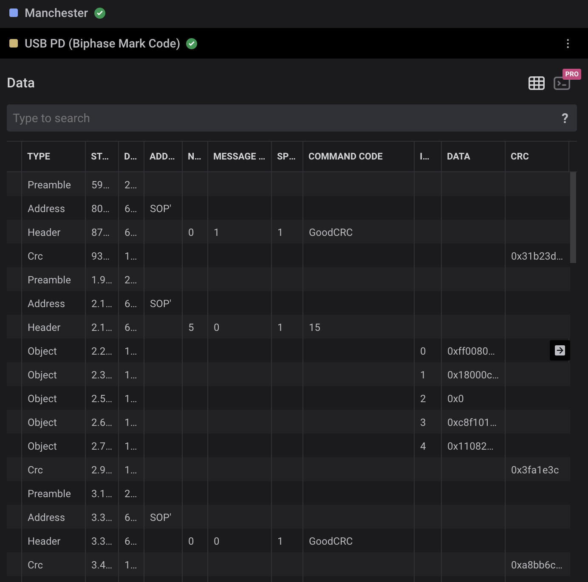
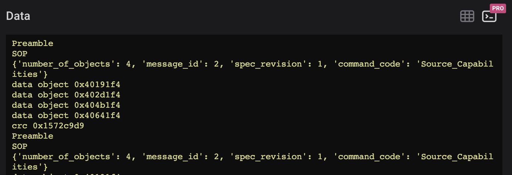

# USB PD (Biphase Mark Code)

Note: It might not be possible to record the USB PD CC signal directly with a Saleae device, because of the voltage thresholds required. It may be necessary to place a comparator in front of the USB PD signal. Specifically, the signal should be interpreted as idle high, so that the very first bit is properly decoded as a zero. An incorrect threshold voltage may cause the first bit to be skipped, however support for this could probably be added in this extension.

## Instructions:

1. Record the USB PD signal (CC).
2. Add the Saleae Manchester analyzer with the following settings
   - Mode: Bi-Phase Mark Code (FM1)
   - Bit Rate: 300000
3. add the USB PD (Biphase Mark Code) Analyzer, and select the manchester analyzer as the input

### This decoder is not yet complete!

It still needs:

- Additional header field decoding
- data object decoding
- crc validation

### Examples

